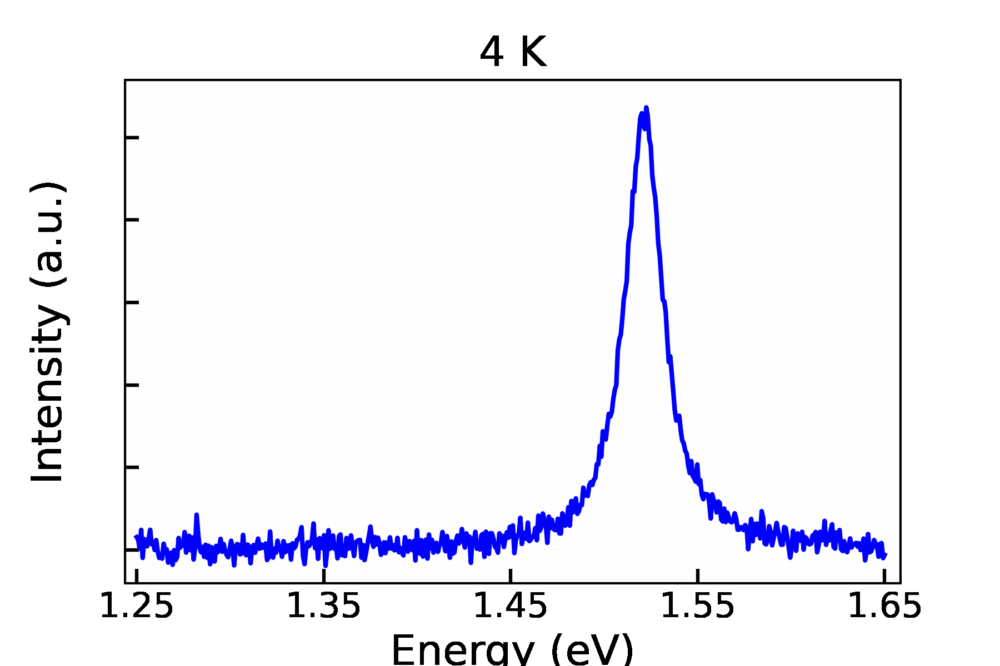

# Making GIFs with Python

A GIF (which is an acronym for ‘Graphics Interchange Format’) is a file format for animated images that are created by looping several frames. GIFs can break down datasets into smaller segments, show trends, and in general tell a visual story in ways a static figure cannot. Therefore, GIFs can be used as a data analysis and visualisation tool for STEM Ph.D. students and data scientists.

Ιn this tutorial, we will see how to turn a static visualisation into a GIF with Python and the [gif](https://pypi.org/project/gif/) package. As an example, I decided to visualise how the emission spectrum of a semiconductor changes with temperature. The temperature dependence of our imaginary semiconductor is studied within a range from 4 to 300 K (in other words, from -270 °C to room temperature). Throughout this whole range, the material emits in the microwave regime (energy lower than the infrared).

The result is:

## Resources Used

Python Version: 3.7  
Jupyter Notebook Version: 5.7.8  
Packages: matplotlib, gif, numpy, pandas
