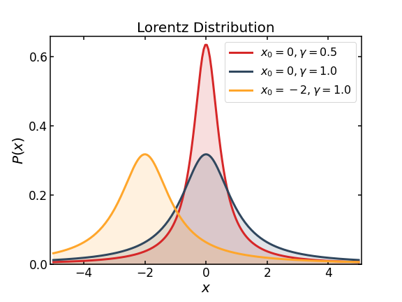
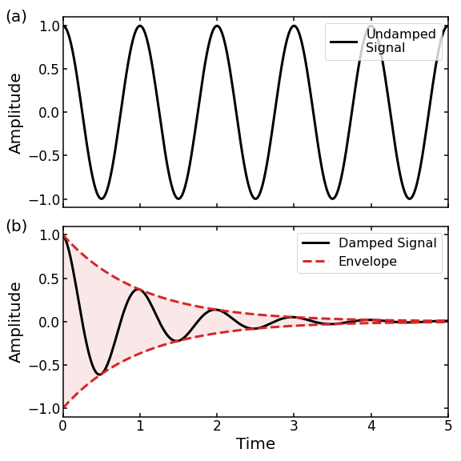

# Plotting Publication-Style Figures

This simple tutorial contains the template I use for plotting figures. I developed it during my postgraduate studies, so it is heavily influenced by visualisation practices widely used in academia. 

Specifically, we will learn how to plot the **graph of a function**, which is an essential tool for every STEM PhD student. Of course, there are dozens of different visualisation elements (e.g. bar charts, box plots, heatmaps, etc.), each with its own unique requirements. However, the customisation techniques described in this tutorial are transferable and do not just apply to graphs.

The tutorial relies on **[`Matplotlib`](https://matplotlib.org/)** (Version 3.5.1), the most widely-used Python library for data visualisation. This choice is based on the fact that `Matplotlib` makes it easy to plot a publication-style figure with just a few lines of code.

 

The two figures we will create at the end of this tutorial are shown below:

 

   
  

