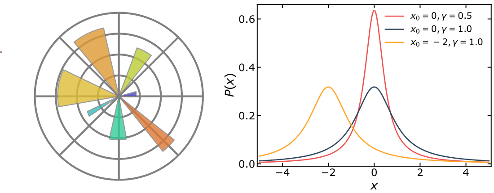

# Plotting publication-style figures

This simple tutorial contains the template I use for plotting figures. I developed it during my postgraduate studies, so it is heavily influenced by visualisation practices widely used in academia. 

Specifically, we will learn how to plot the **graph of a function**, which is an essential tool for every STEM PhD student. As an example, we will plot the **[Lorentz distribution](https://en.wikipedia.org/wiki/Cauchy_distribution)**. 

Of course, there are dozens of different visualization elements (e.g. bar charts, box plots, heatmaps, etc), each with its own unique requirements. However, the customization techniques described in this tutorial are transferable and do not just apply to graphs.

Lastly, our tutorial relies on Matplotlib, the most widely-used Python library for data visualization. My choice is based on the fact that Matplotlib makes it easy to plot a publication-style figure with just a few lines of code.

Let's get to it!

